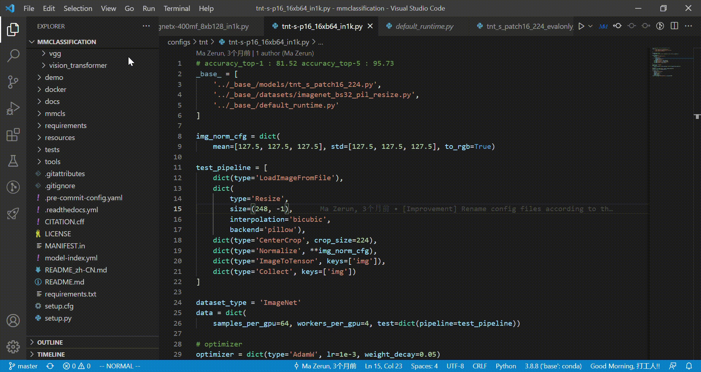

## ConfigView

ConfigView automatically evaluates python configs for [OpenMMLab](https://github.com/open-mmlab). The plugin was modified from [AREPL-python](https://marketplace.visualstudio.com/items?itemName=almenon.arepl#overview).

ConfigView is availible for free on the vscode [marketplace](https://marketplace.visualstudio.com/items?itemName=Allent.config-view#overview).

## Usage



First, make sure you have [python 3.7 or greater](https://www.python.org/downloads/) installed.

Install the python package `mmconfig` through:
```shell
pip install mmconfig
```

Open a python file and click on the   in the top bar to the right to open ConfigView. You can click the icon again to close.

Or run ConfigView through the command search: `control-shift-p`

or use the shortcuts: `control-shift-a` (current doc) / `control-shift-q` (new doc)

## FAQs
- Always remember to set the python path to use for Config View. In setting.json, add the following line:
```json
"ConfigView.pythonPath": ${PYTHON_PATH},
```

## Reference
- [AREPL-vscode](git@github.com:Almenon/AREPL-vscode.git)
- [open-file-from-path](git@github.com:Jack89ita/vscode-open-file-from-path.git)